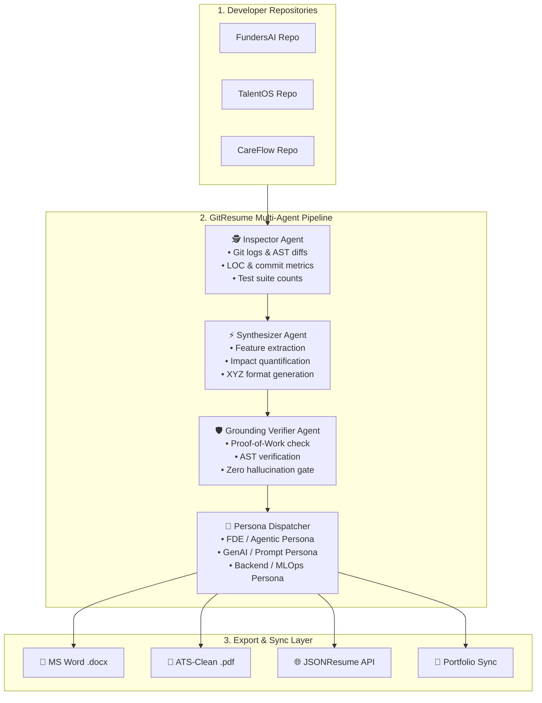

# GitResume AI (Proof-of-Work Agent)
### Autonomous Multi-Agent Resume & Portfolio Intelligence Engine (Open-Source)

---

## 📌 1. Executive Summary

**GitResume AI** is an open-source, multi-agent developer tool that bridges the gap between active software engineering and career collateral. It continuously inspects local Git repositories, parses commit histories, code diffs, and test suites, and autonomously synthesizes grounded, quantifiable resume bullet points across multiple role-specific personas (Applied AI / FDE, GenAI, MLOps, Full-Stack).

```
   ┌───────────────────┐        ┌───────────────────────┐        ┌───────────────────┐
   │   Git Commits &   │ ─────> │   GitResume Agentic   │ ─────> │   ATS-Ready DOCX, │
   │   Codebase Diffs  │        │   Intelligence Engine │        │   PDF, Webhooks   │
   └───────────────────┘        └───────────────────────┘        └───────────────────┘
```

---

## 🎯 2. Problem Statement & Opportunity

### The Problem
* **Resume Drift:** Engineers build complex microservices, agent workflows, and data pipelines daily, but their resumes remain months behind.
* **Vagueness & Lack of Metrics:** Developers struggle to translate raw pull requests and refactors into the high-impact **Google XYZ / STAR format** (*"Accomplished [X], as measured by [Y], by doing [Z]"*).
* **Persona Fatigue:** Maintaining 3–4 tailored resumes (e.g., Forward-Deployed AI, Backend MLOps, Core ML) requires manual re-writing and error-prone copy-pasting.

### The Solution
An autonomous multi-agent pipeline that transforms code repositories into verifiable proof-of-work achievements with strict **anti-hallucination grounding** against git diff trees.

---

## 🏗️ 3. Multi-Agent Architecture



---

## 🤖 4. Agent Roles & Specifications

| Agent | Responsibility | Core Logic & Tooling |
| :--- | :--- | :--- |
| **1. Inspector Agent** | Scans Git diffs, AST modifications, dependency additions, test suites, and LOC metrics. | `git log`, `git ls-files`, `tree-sitter` / `ast` parsing, `pytest`/`jest` discovery. |
| **2. Synthesizer Agent** | Analyzes the semantic intent of code changes and generates structured, action-oriented bullet points. | LLM (Ollama local / OpenAI / Anthropic) with strict XYZ-bullet prompt constraints. |
| **3. Grounding Verifier Agent** | **Anti-Hallucination Gate:** Verifies that every claim, number, and technology mentioned exists in the commit evidence. | Deterministic cross-matcher verifying commit hashes, modified files, and test outputs. |
| **4. Persona Dispatcher** | Routes achievements to target personas based on role classification rules. | Semantic classification matrix (e.g. Kubernetes $\rightarrow$ MLOps; LangGraph $\rightarrow$ Agentic AI). |

---

## ⚙️ 5. Configuration Schema (`gitresume.yaml`)

```yaml
version: "1.0"

developer:
  name: "Naman Manocha"
  email: "namanmanocha42248@gmail.com"
  github: "Naman6019"
  linkedin: "https://linkedin.com/in/namanmanocha"
  location: "Kolkata, India"

llm:
  provider: "ollama"           # Options: "ollama", "openai", "groq", "anthropic"
  model: "qwen2.5-coder:7b"     # Local privacy-first default
  fallback_model: "gpt-4o-mini"
  temperature: 0.2

repositories:
  - name: "FundersAI"
    path: "C:/Users/naman/OneDrive/Desktop/FundersAI"
    tag: "OpenAI Build Week Submission"
    primary_stack: ["Python", "FastAPI", "Next.js", "LangGraph", "Supabase", "Cloudflare R2"]
    
  - name: "TalentOS"
    path: "C:/Users/naman/OneDrive/Desktop/ALLThingsAgentic"
    tag: "All Things Agentic Hackathon (Taskmaster Track)"
    primary_stack: ["Python", "Google ADK", "LangGraph", "Gemini", "Vertex AI", "Firestore"]

personas:
  - id: "fde"
    title: "Agentic AI / Forward-Deployed Engineer"
    template: "./templates/fde_template.docx"
    emphasis: ["multi-agent orchestration", "human-in-the-loop", "stakeholder delivery", "guardrails"]

  - id: "genai"
    title: "Generative AI Engineer"
    template: "./templates/genai_template.docx"
    emphasis: ["grounded RAG", "abstention", "prompt engineering", "evals", "fine-tuning"]

  - id: "ai_engineer"
    title: "AI / ML Engineer"
    template: "./templates/ai_engineer_template.docx"
    emphasis: ["applied ML", "clustering", "vector search", "full-stack systems"]

output:
  formats: ["docx", "pdf", "markdown", "jsonresume"]
  destination_dir: "./dist/resumes"
  sync_to:
    - path: "C:/Users/naman/OneDrive/Desktop/Personal/portfolio_site/public/resume"
      clean_before_sync: true
```

---

## 💻 6. CLI Commands & Workflow

```bash
# 1. Install via pip
pip install git-resume-agent

# 2. Initialize in your developer workspace
git-resume init

# 3. Interactive scan & preview of new achievements
git-resume scan --since "14d" --interactive

# 4. Compile all personas and sync to portfolio
git-resume sync --all

# 5. Install automated Git post-commit hooks across all repos
git-resume hooks install
```

---

## 🛡️ 7. The Grounding & Verification Engine (How It Eliminates Hallucinations)

```
[ Code Change in Repo ] ───> [ Synthesizer Proposes Bullet ]
                                      │
                                      ▼
                        [ Grounding Verifier Checks ]
                        ├─ 1. Did the developer commit to these files? (YES)
                        ├─ 2. Does the mentioned technology exist in package.json / requirements.txt? (YES)
                        ├─ 3. Do the tests pass in the commit? (YES)
                        └─ 4. Are the metric claims mathematically backed by diff tree? (YES)
                                      │
                                      ▼
                           [ PASS: Written to Resume ]
                           [ FAIL: Rejected / Logged ]
```

---

## 📦 8. Open-Source Distribution Strategy

1. **Python Package Index (PyPI):** `pip install git-resume-agent` (CLI tool built with `Typer` & `Rich`).
2. **GitHub Action Marketplace:** `uses: Naman6019/git-resume-action@v1` for automatic CI/CD portfolio builds on repo pushes.
3. **GitHub Release:** Open-source MIT repository with pre-built templates, interactive terminal UI, and multi-LLM provider support.

---

## 📄 9. Ready-to-Use Resume Bullet for Your Portfolio

> **GitResume AI — Autonomous Multi-Agent Resume & Portfolio Intelligence Engine (Open-Source)**  
> *Python, LangGraph, Ollama, OpenAI API, python-docx, Typer CLI, GitHub Actions | github.com/Naman6019/git-resume-agent*  
> * **Multi-Agent Code-to-Impact Pipeline:** Designed a 4-agent workflow (Inspector $\rightarrow$ Synthesizer $\rightarrow$ Verifier $\rightarrow$ Dispatcher) that parses Git AST diffs, test logs, and commits to autonomously synthesize XYZ-format resume bullets.  
> * **Grounded Proof-of-Work Verifier:** Built a deterministic verification agent that cross-references generated impact claims against commit hashes and dependency trees, eliminating hallucinated metrics.  
> * **Multi-Persona Dispatcher:** Engineered persona-routing logic to dispatch relevant engineering milestones to targeted resume templates (FDE, GenAI, MLOps, Full-Stack) and compile ATS-compliant DOCX/PDF files.
